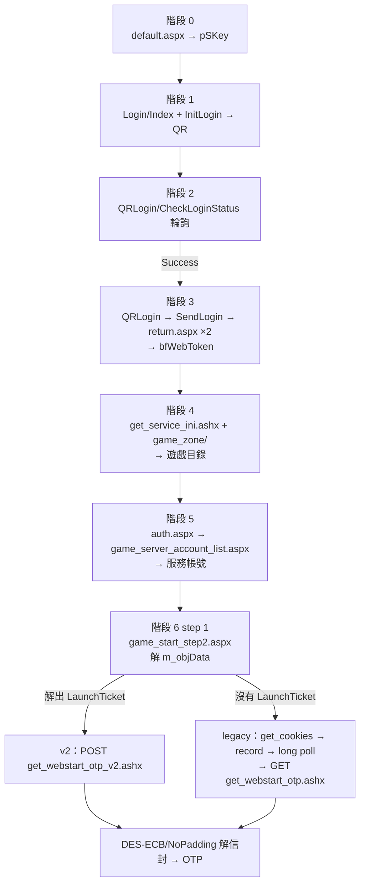

# 協定全流程：從掃 QR 到拿到 OTP

> 這份文件描述 BeanyCord **實際送出**的請求鏈：每一步的 endpoint、參數從哪裡來、
> 以及加解密發生在哪裡。目標是讓「哪一步壞了」在讀完之後可以直接定位。
>
> 協定研究的出處見文末〈致謝與出處〉。針對 2026-08-17 那次中斷的排查過程，
> 見 [`OTP-2026-08-17.md`](./OTP-2026-08-17.md)。
>
> 範圍：**僅 TW**。QR 登入在原始客戶端就是 TW 限定，HK 未實作。

## 全景



登入成功後，`sessionManager` 另起每 60 秒一次的 keep-alive（見〈Session 保活〉）。

---

## 階段 0：取得 pSKey

`src/beanfun/login/sessionKey.ts:11`

```
GET https://tw.beanfun.com/beanfun_block/bflogin/default.aspx?service=999999_T0
```

`999999_T0` 是官方客戶端使用的佔位服務代碼。回應會經過一連串 302，**`pSKey` 只出現在
最終網址的 query 上，不在任何 body 裡**，所以要讀 `finalUrl(res)`（並防禦性地掃過每個
重導 hop）。

## 階段 0 的閘：beanfun 的 IP 風控

`src/beanfun/login/sessionKey.ts` · `src/core/guard.ts` · `src/dev/rateProbe.ts`

整條鏈上**只有 `bflogin/default.aspx` 這一個 endpoint 有配額**。2026-08-19 實測，
下面這些全部沒有閘（括號內是實際打到的量，都沒撞到任何上限）：

| endpoint | 打法 | 結果 |
| --- | --- | --- |
| `echo_token.ashx`（保活） | 60 並發 × 3 輪 = 180 發 | 無閘 |
| `game_start_step2.aspx`（列帳號） | 20 並發 × 3 輪 = 60 發 | 無閘 |
| `QRLogin/CheckLoginStatus`（輪詢） | 80 連發 / 32 秒 | 無閘 |
| `game_zone/`、兩個 host 的大門 | — | 無閘 |

所以「重啟後所有 session 的 ping 同時打出去」和「`account.ts` 用 `Promise.all`
一次噴 N 個角色查詢」這兩個看起來最危險的並發，量完都不是問題。

### 被擋長什麼樣

**HTTP 200。** 又一個用 200 說謊的 endpoint（另外兩個見〈三個最容易誤解的地方〉）。
`ensureSuccess` 會通過，下游唯一的症狀是 pSKey 莫名其妙不見了。

兩個識別標記**分別在不同地方**，而且直覺的那個不在 body 裡：

| 標記 | 位置 | 內容 |
| --- | --- | --- |
| 檔名 | **只在重導向後的最終 URL** | `/TW/BlockIPMessage.htm` |
| 句子 | **只在 body**（544 bytes） | `但由於短時間造訪過於頻繁，IP已自動被系統鎖定。` |

任一個都足以認出，兩個都檢查是為了 beanfun 改文案或改檔名時還有一個能擋
（`isIpBlockedPage()` / `assertNotIpBlocked()`，`src/beanfun/client.ts`）。

### 三件已定案的事

- **是 IP 層級。** 同一支手機，Wi-Fi 被擋、切行動網路正常。
- **數次數，不數速率。** 同樣是第 5 次被擋，不管那五次花了 12 秒、35 秒還是 76 秒。
- **罰則固定 4～5 分鐘，而且不會被後續請求延長。** 量了三次都一樣；罰則期間繼續打
  不會讓它變久，所以探測恢復是免費的。

### 配額與窗口寬度：**尚未定案，而且會動**

這一節刻意不給數字，因為量到的數字互相矛盾：

| 何時 | 方法 | 唯一相容的模型 |
| --- | --- | --- |
| 2026-08-19 11:36Z | 階梯：間隔從 45 秒逐步收緊，27 次成功後被拒 | **窗口 80 秒、配額 4** |
| 2026-08-19 15:00Z | 從下面探：填滿 4 個，隔 D 秒再送一個 | **窗口 ≥ 177 秒**（D 從 120 試到 177 全被拒） |

同一個 IP，相隔 3.5 小時，中間被我們反覆猛打。把兩組資料套進「滑動窗口 + 固定配額」
逐一比對，**沒有任何一組 (W, Q) 能同時解釋兩者** —— 集合完全不相交。

最合理的解釋是風控會**針對這個位址的近期行為收緊**（reputation-based）。這也不需要
「機房 IP 額度比較低」就能解釋為什麼線上部署也撞到：那個 IP 同樣被打過。

**工程上的結論是：沒有任何靜態預算能被證明安全。** 所以限流器把「被拒絕」當成唯一
可信的校正訊號 —— 撞到就自己關禁閉（`RateGate.penalise()`），並把當下我們自己的
足跡一起印進 log，因為那是唯一能分辨「額度被鄰居用掉」和「配額本來就更小」的東西。

### 方法論：為什麼「被擋後多久恢復」量不到窗口

那量到的是**罰則**。任何觸發拒絕的實驗都會立刻進入 4～5 分鐘禁閉，訊號被蓋掉。

正確的做法是**在不觸發的前提下從下面探**：填滿配額 → 等 D 秒（從**第一個**請求起算）
→ 再送一個。被拒表示第一個仍被計入（W ≥ D），放行表示它已滑出（W < D）。D 的翻轉點
就是 W。填的過程順便校準配額 —— 填到一半被拒，那個數字就是真實配額。

`npm run probe:rate -- --go --arm=window --search` 就是這個。**注意**：二分搜尋的上界
必須真的被一次「放行」證實過，否則它只會收斂到你給的參數上；這支腳本第一次跑就掉進
這個陷阱，現在會明說「未建立上界」而不是印出一個賺不到的區間。

## 階段 1：產生 QR Code

`src/beanfun/login/qrInit.ts:18`

| # | 請求 | 說明 |
| --- | --- | --- |
| 1 | `GET login.beanfun.com/Login/Index?pSKey=…` | 刮 `__RequestVerificationToken`。**寬鬆**：刮不到就以空字串繼續 |
| 2 | `GET login.beanfun.com/Login/InitLogin?pSKey=…` | `Referer` = 上一步網址、`X-Requested-With: XMLHttpRequest`、`Origin` |

回應：

```json
{ "Result": 0, "ResultData": { "QRImage": "<base64 PNG>", "DeepLink": "…" } }
```

`QRImage` 是**伺服器直接產生的 PNG**，我們只加上 `data:image/png;base64,` 前綴後丟給
Discord。QR 的內容不由我們編碼，也沒有任何本地繪製。

## 階段 2：輪詢掃描狀態

`src/beanfun/login/qrPoll.ts:15`

```
POST login.beanfun.com/QRLogin/CheckLoginStatus
Headers: Referer, Origin, Content-Type: application/x-www-form-urlencoded,
         Content-Length: 0, RequestVerificationToken（有拿到才送）
Body:    （完全空）
```

兩個踩過的坑：

- **必須送 `Content-Length: 0`**。若讓 HTTP 客戶端以 `Transfer-Encoding: chunked`
  送出無長度的 body，伺服器回 **HTTP 411**。
- **故意不送 `X-Requested-With`** —— WPF 在這一步會先把所有 header 清空。

回應 `ResultMessage` 只有四種：`Wait Login` / `Success` / `Failed` / `Token Expired`，
其他值一律當協定變更拋錯。

### 多人同時登入不會互相汙染

`CheckLoginStatus` 的 body 是**完全空的**，所以「這是誰的 QR 場次」全由 cookie 與
`Referer` 決定 —— 而部署裡所有人共用一個對外 IP，這是唯一可能串線的地方。

2026-08-19 實測（`npm run probe:isolation`）：同一個 IP 開兩場，兩個 client 各自拿到
不同的 pSKey、不同的 QR、以及**不同的 `GamaLoginSession` cookie**。真的用手機掃了其中
一場之後，**只有那一場翻成 `Success`，另一場維持 `Wait Login`**。伺服器用的是每個
client 自己的 session，不是來源位址。

第二層保險在階段 3：`finalizeQrLogin` 送出的 `SessionKey` 是**呼叫者自己的 pSKey**。
所以即使輪詢誤報，對方拿到的也只是登入失敗。實測失敗發生在 `Login/SendLogin` ——
它對未核准的 session 根本不發表單，連 `return.aspx` 都到不了。

## 階段 3：完成登入

`src/beanfun/login/qrFinalize.ts:21`。輪詢回 `Success` 後的四個請求：

| # | 請求 | 內容 |
| --- | --- | --- |
| 1 | `GET login.beanfun.com/QRLogin/QRLogin` | 握手，body 丟棄 |
| 2 | `GET login.beanfun.com/Login/SendLogin` | 刮出整組 hidden input（QR 專用的 `Accept`） |
| 3 | `POST tw.beanfun.com/beanfun_block/bflogin/return.aspx`<br/>**不跟隨重導** | form = 上一步的 hidden inputs。從 302 的 `Set-Cookie` 抓 `bfWebToken`，**抓完即丟**；抓不到也容忍（WPF parity） |
| 4 | `POST` 同一個 `return.aspx`<br/>**跟隨重導** | form = 固定五欄，見下。之後從 cookie jar 讀正式的 `bfWebToken` |

第 4 步的固定表單：

```
SessionKey       = pSKey
AuthKey          = "OK"
ServiceCode      = ""
ServiceRegion    = ""
ServiceAccountSN = "0"
```

第 3 步**必須關閉重導**，否則 `Set-Cookie` 會在重導過程中被吞掉 —— 這是
`httpNoRedirect` 這個第二個 got 實例存在的唯一理由（`src/beanfun/client.ts`）。

> **登入全程沒有任何客戶端加密。** QR 路線把帳密登入才需要的那段（WPF 的密碼
> 加密）整條繞過去，我們自始至終只是在搬運 token。

此時 session 成形：

```ts
{ region: 'TW', skey, webToken, accountId, serviceCode: '610074', serviceRegion: 'T9' }
```

`610074_T9`（新楓之谷）是 WPF-parity 的預設服務，也**正好是走 v2 路線的那款遊戲** ——
所以 v2 是預設路徑，不是邊緣案例。

cookie jar 此時持有 `bfWebToken`，以及**兩個**同名的 `bfSecretCode`（見階段 6）。

## 階段 4：遊戲目錄

`src/beanfun/games.ts:16`

```
GET tw.beanfun.com/beanfun_block/generic_handlers/get_service_ini.ashx   → exe / 視窗類別 / 註冊表路徑
GET tw.beanfun.com/game_zone/                                           → 服務清單（service_code + region）
```

兩者都是**公開資料**：實測 session 已死時 `game_zone/` 仍回傳完整目錄。因此這裡若解析
失敗，原因是格式變更而不是登出 —— 程式碼裡兩種錯誤刻意分開，好讓日誌能區分。

## 階段 5：列出服務帳號

`src/beanfun/account.ts:29`

| # | 請求 | 說明 |
| --- | --- | --- |
| 1 | `GET beanfun_block/auth.aspx`<br/>`?channel=game_zone`<br/>`&page_and_query=game_start.aspx?service_code_and_region=<sc>_<sr>`<br/>`&web_token=<jar 內的 bfWebToken>` | 只有 cookie 副作用，body 丟棄 |
| 2 | `GET beanfun_block/game_zone/game_server_account_list.aspx?sc=&sr=&dt=` | 刮出每列 `{ isEnable, sid, ssn, sname }` 與額度公告 |
| 3 | 每個帳號並發 `GET game_zone/game_start_step2.aspx?service_code&service_region&sotp=<ssn>&dt=` | 只為刮 `ServiceAccountCreateTime`。5 秒預算，失敗降級為 `null` |
| 4 | — | 依 `ssn` 升冪排序 |

`dt` 一律是 `yyyyMMddHHmmss` 形式的快取破壞參數（`src/beanfun/time.ts`）。

> **第 1 步是「把 portal 切換到這款遊戲」的動作。** 跳過它不會報錯，而是安靜地回傳
> 上一款遊戲的資料 —— `probe:otp` 就是因此才必須走完整的 `getAccounts`。

`web_token` 取自 **cookie jar**（`readBfWebToken()`）而非 session 快取，因為 jar 才是伺服器
當下承認的那一份。

第 2 步取得空清單時，才進一步判斷 session 是否已死：成功的回應也是 HTML，所以
「這是不是 HTML」永遠不能單獨當判準 —— 順序必須是「先解析失敗，再驗屍」。

---

## 階段 6：取得 OTP

`src/beanfun/otp.ts:84`。**兩套協定並存**，同一支程式碼、同一個 session，依遊戲分流。

### Step 1（共用）：讀啟動頁

```
GET tw.beanfun.com/beanfun_block/game_zone/game_start_step2.aspx
    ?service_code=<sc>&service_region=<sr>&sotp=<ssn>&dt=<yyyyMMddHHmmss>
```

這個 URL 字串會被保留下來，之後 v2 的 POST 拿它當 `Referer`（所以是手工組 URL 而非
交給 `searchParams`）。從 HTML 刮四樣東西（`src/beanfun/parser.ts`）：

| 目標 | 樣式 | 用途 |
| --- | --- | --- |
| `m_objData` = `{region, sn, data}` | `var m_objData = {…}` | 啟動器 handoff，**決定路線** |
| longPollingKey | `GetResultByLongPolling&key=(.*)"` | legacy 的 `SN` |
| unk-data | `MyAccountData.ServiceAccountCreateTime + "(k)=(v)";` | step 3 的額外表單欄位 |
| createTime | 同上頁面 | step 3 / step 5 |

**讀 handoff 必須放在最前面。** 已遷移的頁面已經不再帶 `GetResultByLongPolling&key=`
之類的字串，若先強制要求那些字面值，就會在讀到同一頁裡的 handoff 之前就失敗，
而且錯誤訊息會指著一個**本來就該消失**的東西。

### 解碼 `m_objData.data`

`src/beanfun/launchData.ts:122`。這是整條鏈唯一的混淆層：

1. 第一個字元 `n` 是 hex digit，用來選 **8 張替換表**之一
2. 其餘每個字元 → 它在該表中的 **index**，重新輸出為 hex digit ⇒「normalized hex」
3. normalized hex 的 offset `n + 1` 起算 **8 個字元 = DES 金鑰**（ASCII）
4. 把那 8 個字元挖掉，剩下的即 ciphertext hex
5. **DES-ECB / NoPadding** 解密，去除頭尾 `\0`
6. 明文為 `key=value`，以 `&&&&` 串接（與 `gamaniagames://` handoff URI 同一個分隔符）

步驟 3–5 與 v2 之前的 OTP 信封是**同一種構造**，所以 `wcdes.decryptHex` 原樣沿用；
新的只有替換層與欄位解析。

選表規則未定案：`n % 4` 對目前所有樣本都成立，但表有 8 張、樣本太少，無法排除
「只是表的排列順序不同」。因此實作是**逐表嘗試，以「輸出像不像文字」收斂**：

```ts
// looksLikeText: 含 '=' 且可列印 ASCII 佔比 ≥ 95%
```

實測正確的表給出 100% 可列印，錯誤的表落在 43% 附近，中間留有極寬的間隔。

> **絕不以「明文含 `LaunchTicket=`」當接受條件。** 那會把「表選錯」和「表選對、
> 但欄位組合不同」混為一談 —— 一個完全正確的解碼會被報成「沒有表可用」，
> 而這正是害我們追錯一整輪的原因。**以形狀接受，內容另外回報。**

### 路線判定

**看解出來有沒有 `LaunchTicket` 欄位，不是看 `m_objData` 存不存在。**

| 遊戲 | blob 解出的欄位 | 路線 |
| --- | --- | --- |
| 新楓之谷 `610074_T9` | `LaunchTicket, ServiceCode, ServiceRegion, ServiceAccount, BeanfunUrl, WebStartPatch` | **v2** |
| 瑪奇 `600309_A2` | `ppppp(112 字元), ServiceCode, ServiceRegion, ServiceAccount, CreateTime, BeanfunUrl, WebStartPatch` | **legacy** |
| CSO `610153_TN` | 同瑪奇 | **legacy** |
| 艾爾之光 `300148_AF` | 同瑪奇 | **legacy** |

四款遊戲**全部帶有 `m_objData`**，只有新楓之谷帶 `LaunchTicket`。上游客戶端以
「有沒有 handoff」判斷，因此把三款仍在 legacy 的遊戲送去 v2 —— 那就是
[pungin/Beanfun#376](https://github.com/pungin/Beanfun/issues/376) 那批災情的成因。

解碼失敗時**不視為致命**：會 fallback 回 legacy，但同時發出高聲量警告 —— 那是替換表
在啟動器 DLL 裡被改掉的特徵訊號，若被靜靜吞掉，最後只會看到一個毫無關聯的
`Query String Error`。

---

### 路線 A：legacy（4 步 + 解密）

```
Step 2  GET tw.newlogin.beanfun.com/generic_handlers/get_cookies.ashx
Step 3  POST tw.beanfun.com/beanfun_block/generic_handlers/record_service_start.ashx
Step 4  GET  tw.beanfun.com/generic_handlers/get_result.ashx?meth=GetResultByLongPolling&key=…
Step 5  GET  tw.beanfun.com/beanfun_block/generic_handlers/get_webstart_otp.ashx?<9 params>&CV&Hash&arch
```

#### Step 2 — SecretCode（`src/beanfun/otp.ts:212`）

注意主機是 **newlogin**（`tw.newlogin.beanfun.com`），不是 portal。從回應刮
`var m_strSecretCode = '…';`，**但那只是 fallback**。真正送出的是 cookie jar 裡的
`bfSecretCode`：

```ts
const code = (await client.readSecretCode()) ?? pageCode;
```

jar 裡同時存在兩個同名 cookie（一個 `.beanfun.com`、一個 host-only `tw.beanfun.com`），
**值不同**。ASP.NET 的 `Request.Cookies["bfSecretCode"]` 取 Cookie 標頭中的第一個，而
got 送出的順序與 tough-cookie 的 jar 順序一致 —— 所以取 index 0 拿到的，正是伺服器會
拿去比對的那一個。

這是 BeanyCord **刻意偏離 1:1 移植**的一處：WPF 與 Rust 都送頁面值。請求本身仍然發出，
因為官方流程在這個位置會發，而我們沒有證據說明它還順帶 prime 了什麼。

#### Step 3 — 記錄啟動（`src/beanfun/otp.ts:222`）

```
POST record_service_start.ashx          （不送 Referer）
form = {
  service_code, service_region,
  service_account_id = acc.sid,
  sotp               = acc.ssn,
  service_account_display_name = acc.sname,
  service_account_create_time  = screatetime,
  <unk-data key> = <unk-data value>,
}
```

實測：**沒有 `Referer` 也會回 `{'intResult': 1, 'strOutstring': 'Success'}`。**

#### Step 4 — 長輪詢，點火即棄（`src/beanfun/otp.ts:269`）

```
GET generic_handlers/get_result.ashx?meth=GetResultByLongPolling&key=<longPollingKey>&_=<ISO>
```

這是**啟動器的安裝檢查，與密碼無關** —— step 5 不論這步成敗都會回傳 OTP 信封（實測
確認：找出 SecretCode 修正的那次掃描，這一步全程失敗仍拿到信封）。

因此它**故意不送 `Referer`**，讀起來像寫反了，但看代價就清楚了：

| 有無 Referer | 伺服器行為 | 對我們的代價 |
| --- | --- | --- |
| 不送 | 立刻拒絕 | 免費、瞬間，馬上往下走 |
| 送 | **真的**開始長輪詢、把連線掛住 | 每次取密碼多數秒延遲 |

既然我們不要它的答案，會快速失敗的那個版本才是對的。5 秒預算留著只是安全網。

#### Step 5 — 取信封（`src/beanfun/otp.ts:280`）

**必須手工組字串，不能用 query builder**：空白要編成 `%20` 而不是 `+`，而且 `ppppp`
不能被二次編碼。

| 參數 | 來源 |
| --- | --- |
| `SN` | step 1 刮到的 longPollingKey |
| `WebToken` | `session.webToken` |
| `SecretCode` | **jar 的 `bfSecretCode[0]`**（見 step 2） |
| `ppppp` | blob 解出的 `ppppp`；頁面沒給才用寫死的 64-hex 常數 |
| `ServiceCode` / `ServiceRegion` | 使用者所選 |
| `ServiceAccount` | `acc.sid` |
| `CreateTime` | `screatetime`，空白 → `%20` |
| `d` | `TickCount`（i32 快取破壞值，伺服器不讀） |
| `CV` / `Hash` / `arch` | GGM 常數，見〈客戶端驗證〉 |

回應形狀：

```
成功  1;<8 字元 ASCII 金鑰><ciphertext hex>
失敗  0;<8 個空白><訊息>
```

那 8 個空白，就是成功時放金鑰的欄位被拿來重用於錯誤格式。**訊息本身即診斷**：

| 訊息 | 意義 |
| --- | --- |
| `Query String Error` | 伺服器**根本不讀**這個請求 → 這款遊戲已遷移到 v2 |
| `Error: <關於某個值>` | 讀了，但某個輸入不對 → 舊端點對這款遊戲**還活著** |

### 路線 B：v2（2 步）

`src/beanfun/otp.ts:342`

```
Step 3  record_service_start.ashx        ← best-effort，失敗不影響取密碼
Step 5  POST beanfun_block/generic_handlers/get_webstart_otp_v2.ashx
        Headers: Referer = step 1 的頁面網址   ← 全鏈唯一送 Referer 的地方
        Body (JSON):
          { "SN": m_objData.sn,
            "LaunchTicket": <blob 解出的>,
            "CV": …, "Hash": …, "arch": … }
        → { "result": 1, "data": "<8 字元金鑰><cipher hex>", "message": null }
```

舊的九個 query 參數**只有 `SN` 活下來**；沒有 `SecretCode`、沒有 `WebToken` —— 授權整個
轉移到 `LaunchTicket` 上。step 2 與 step 4 一併跳過。

`LaunchTicket` **不需要額外請求**：它就在 step 1 已經抓回來的那個頁面的 blob 裡。

`result !== 1` 時，`message` 欄位帶著伺服器自己的拒絕理由。已知的兩個是 enum 風格的
token，而且意思相反（見〈客戶端驗證〉）：

| `message` | 我們拋的錯誤碼 | 意義 |
| --- | --- | --- |
| `Client_Integrity_Failed` | `otp.launcher_rejected` | **CV/Hash 被拒**，所有人一起壞 |
| `Invalid_Start_Ticket` | `otp.ticket_rejected` | 身分**通過了**，是票的問題 |
| 其他 | `otp.server_rejected` | 看不懂 —— 此時才印 `ggmVerdict()` |

`ggmVerdict()` 只印在前者與「其他」旁邊。`Invalid_Start_Ticket` **不印**：身分檢查在票
之前判定，所以這個回應本身就是身分通過的證明，印出來等於指控一個剛被伺服器放行的
元件。

伺服器的 `message` 只有在**還像個理由**時才轉述給使用者：單行、無標記、120 字元
以內 —— 否則那個欄位可以塞進整頁 HTML，而那正是曾經把原始標記送進使用者私訊的原因。

---

## 加解密總覽

整條鏈**只有一種密碼學原語**：**DES-ECB / NoPadding，8 byte ASCII 金鑰**
（`src/beanfun/wcdes.ts`）。它出現兩次，而且共用同一份實作：

| 位置 | 密文 | 金鑰 |
| --- | --- | --- |
| 啟動器 handoff | normalized hex 挖掉金鑰後的剩餘 | normalized hex 的 offset `n+1` 起 8 字元 |
| OTP 信封（新舊共用） | payload 第 9 字元起 | payload 前 8 字元 |

其餘全部依賴 HTTPS 與 cookie：**沒有簽章、沒有 nonce、沒有 HMAC、沒有時間戳驗證**。

實作重點：

- Node `crypto` 的 `des-ecb` + `setAutoPadding(false)`，與 .NET 的
  `DES + ECB + PaddingMode.None` byte-equal。
- **需要 `--openssl-legacy-provider`** —— 單 DES 在 OpenSSL 3（Node 18+）預設停用。
  npm scripts 已設 `NODE_OPTIONS`，部署（systemd/pm2）必須跟著設。
- 純 JS 的 `des.js` 不可用：它只有 PKCS padding，沒有 NoPadding 模式。
- 明文永遠是 8 byte 的整數倍、尾端以 `\0` 補齊。**因此 OTP 長度是「trim 停在哪裡」
  決定的，不固定、也不是每款遊戲固定** —— 同一個瑪奇帳號一次回 9 字元、一次回
  10 字元，兩次都成功登入遊戲。**永遠不要寫死、驗證或依長度排版。**

### 客戶端驗證（CV / Hash / arch）

`src/beanfun/clientIntegrity.ts`。這是唯一的「你是誰在問」關卡，而且只是明文常數：

```
CV   = GGM 組件版本（GGMWebStart.dll），目前 1.5.0.2
Hash = 該 DLL 的 SHA-256（小寫 hex）
arch = 呼叫端行程的位元數（x64 / x86）
```

我們是無頭 Linux 服務，本機永遠不會有 GGM，所以常數是唯一來源 —— 實測**從未安裝過
GGM 的非 Windows 主機也會被接受**。

**只有 v2 會讀這三個值，而且讀得很嚴格。** 兩條路線都實測過（`npm run probe:otp`，
每臂都重新抓一張新票，所以「票用過了」不可能冒充「身分被拒」）：

| 送出的 triple | legacy GET (`600309_A2`) | v2 POST (`610074_T9`) |
| --- | --- | --- |
| 我們的釘選值 | 回傳信封 | **OK** |
| 完全省略 | 回傳信封 | `Client_Integrity_Failed` |
| 兩個都錯 | 回傳信封 | `Client_Integrity_Failed` |
| 只有 `CV` 錯 | — | `Client_Integrity_Failed` |
| 只有 `Hash` 錯 | — | `Client_Integrity_Failed` |

也就是說 **v2 是必填、成對驗證**：換版當天不能只改版本號，兩個值必須一起換成同一個
真實 build 的。legacy 仍然照送，是為了讓請求形狀貼近官方啟動器（對風控較安全），
不是因為必要。

> **實用推論：legacy 路線壞掉時，GGM 釘選值不是嫌疑犯。** 只有 v2 讀它。

### 這組值會不會過期？直接問伺服器

`src/beanfun/ggmCanary.ts`。上面那組實測還發現一件更有用的事：**身分檢查在票之前
判定，而且不需要登入。**

| 送出 | 回應 |
| --- | --- |
| 廢票 + 我們的 pair + session cookie | `Invalid_Start_Ticket` |
| 廢票 + 錯的 pair + session cookie | `Client_Integrity_Failed` |
| 廢票 + 我們的 pair + **完全沒有 cookie** | `Invalid_Start_Ticket` |
| 廢票 + 錯的 pair + **完全沒有 cookie** | `Client_Integrity_Failed` |

所以只要送一個**帶著隨機廢票**的 POST，就能問出「我們這組還被接受嗎」——不需要
使用者、不需要 session、不消耗真票、不產生任何 OTP。

這解掉了原本無解的偵測問題：**使用者選的遊戲會被持久化並跨重啟保留**，所以一個大家
都停在 legacy 遊戲的部署可能好幾個月不發任何 v2 請求，換版壞掉的第一個訊號會是一個
說不清楚發生什麼事的使用者。

canary 是**三態，不是兩態**：

```
Invalid_Start_Ticket     → healthy
Client_Integrity_Failed  → rejected（警報）
其他任何東西             → inconclusive，絕不當成健康
```

第三態是重點。把不認識的回應讀成「健康」的檢查，會在 beanfun 改字串或 WAF 回一頁
HTML 之後，永遠回報成功卻什麼都沒量到 —— `isLoggedOutEcho` 就是這樣在 production
活了好幾週。

**因此這個檢查值得排程，而版本比對不值得。** 版本不同不是故障（beanfun 可能繼續接受
舊的很久），但被拒絕就是故障本身。`bot.ts` 在啟動時與每 24 小時跑一次，只有在
`rejected` 時才 DM `OWNER_DISCORD_ID`，而且**一次故障只講一次**，不會每天重複到被
無視。

`npm run check:ggm` 現在會把四個來源一起印出來：

```
local     cv=1.5.0.2 hash=dfd568a6… arch=x64
upstream  cv=1.5.0.2 hash=dfd568a6…
beanfun   version=1.5.0.2
canary    healthy — beanfun still accepts this pair (refused only the throwaway ticket)

[accepted] …
```

canary 的答案**壓過**其他三個：版本差異只是對「還接不接受」的猜測，canary 是直接問。
比對仍然照跑，因為「被拒絕了」只是半個答案，另外半個——**要換成什麼**——只有上游的
`ggm-client.json` 答得出來。

---

## Session 保活

`src/core/sessionManager.ts` + `src/beanfun/client.ts:105`。每位登入使用者每 60 秒
（WPF `pingWorker` 的節奏）：

```
GET tw.beanfun.com/beanfun_block/generic_handlers/echo_token.ashx?webtoken=1
```

**這是唯一會誠實回報 session 已死的端點。** 其他端點在 session 死後照樣回 HTTP 200，
只是內容變成登入頁 —— 所以任何「狀態碼正常就當成功」的判斷在這條鏈上都是錯的。
判定 session 死亡、要丟掉使用者的 session 之前，一律以 `echo_token` 為準。

---

## 三個最容易誤解的地方

1. **`SecretCode` 有兩個來源，官方客戶端送的是另一個。** `get_cookies.ashx` 在 newlogin
   主機、答的是那台主機的 session；step 5 打在 portal，驗的是 portal 自己的
   `bfSecretCode` cookie。這是 BeanyCord 特有的問題，上游客戶端不受影響。
2. **`Referer` 只有 v2 的 POST 該送。** legacy 三個 handler 實測都不需要，而
   `get_result.ashx` 給了反而把免費的瞬間失敗換成數秒停頓。
3. **路線只能由「解碼結果」決定，不能由「handoff 存在與否」決定。** 四款遊戲全都帶
   `m_objData`，只有一款帶 `LaunchTicket`。

## 診斷工具

| 指令 | 用途 |
| --- | --- |
| `npm run probe:otp [-- --write]` | 連線跑完整條鏈並加裝儀表，含 step 5 的輸入來源掃描。`-- --list-games` 列出目錄；`SERVICE_CODE=… SERVICE_REGION=…` 可**不重新登入**探測任一款遊戲 |
| `npm run analyze:launch` | 對擷取到的 blob 離線窮舉表 / 方向 / offset |
| `npm run check:ggm` | **問伺服器我們的 `CV`/`Hash` 還接不接受**，並比對上游 `ggm-client.json`（分支 `code`）與 `CheckVersion.ashx` |
| `npm run capture` | 擷取真實回應，之後離線反覆迭代 |
| `npm run probe:rate -- --go` | **找風控的天花板**：在哪裡被拒、拒絕長什麼樣、封鎖範圍多寬、持續多久。`--arm=window --search` 從下面探計數窗口；`--arm=hammer --target=…` 單獨測某個 endpoint 有沒有自己的閘 |
| `npm run probe:isolation` | 同時開兩場登入，實掃其中一場，確認核准落在對的那一場 |

執行中的 bot 每次取密碼會印一行路線判定：

```
[otp] 610074_T9 -> v2 (LaunchTicket present)
[otp] 600309_A2 -> legacy (no LaunchTicket; fields: ppppp, ServiceCode, …)
```

只印欄位名稱，永不印值。

## 相關檔案

| 檔案 | 內容 |
| --- | --- |
| `src/beanfun/endpoints.ts` | 三個主機 base URL 與預設服務代碼 |
| `src/beanfun/client.ts` | cookie jar、兩個 got 實例、`readSecretCode()`、`ping()` |
| `src/beanfun/login/` | 階段 0–3 |
| `src/beanfun/games.ts` / `account.ts` | 階段 4–5 |
| `src/beanfun/otp.ts` | 階段 6，兩條路線 |
| `src/beanfun/launchData.ts` | `m_objData.data` 解碼器 |
| `src/beanfun/wcdes.ts` | DES-ECB/NoPadding |
| `src/beanfun/clientIntegrity.ts` | GGM `CV`/`Hash`/`arch` |
| `src/beanfun/parser.ts` | 全部 HTML 刮取樣式 |

## 致謝與出處

協定研究來自上游 [`pungin/Beanfun`](https://github.com/pungin/Beanfun)；BeanyCord 是該協定的
獨立 Node.js 實作。`get_webstart_otp_v2.ashx` 的契約、`LaunchTicket` 的解碼演算法
（[@takidog](https://github.com/takidog)，於
[pungin/Beanfun#368](https://github.com/pungin/Beanfun/issues/368)）、以及 GGM 客戶端驗證
參數都出自那裡。完整逐項出處見 [`OTP-2026-08-17.md`](./OTP-2026-08-17.md#致謝與出處)
與 [`THIRD-PARTY-NOTICES.md`](../THIRD-PARTY-NOTICES.md)。
